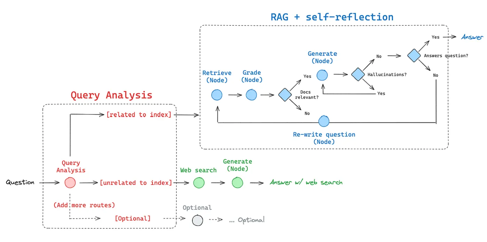

# RAG-LLM Project Collection



## English Documentation

### Overview
This project is a comprehensive collection of various RAG (Retrieval Augmented Generation) implementations and LLM applications. It showcases different approaches to building intelligent chatbots and AI systems using modern language models and retrieval techniques.

### Project Structure

#### 🤖 Main Applications
- **Agents Project** - Advanced AI agent implementation
- **Chat Bot App** - Basic chatbot application
- **Chatbot With Assistants** - Enhanced chatbot with assistant features
- **Corrective RAG** - Advanced RAG system with correction mechanisms
- **RAG Intro** - Basic introduction to RAG concepts
- **Vector Store Project** - Vector database implementation

#### 🔧 Core Components
- **main.py** - Primary application entry point
- **serve.py** - Application server
- **check_models.py** - Model validation utilities
- **message_template.py** - Message formatting templates
- **output_parser.py** - Response parsing utilities

### Key Features

#### Corrective RAG System
The Corrective RAG implementation includes:
- **Router Chain** (`router.py:20-44`) - Intelligent query routing between vectorstore and web search
- **Generation Chain** (`generation.py:10-12`) - Text generation using LangChain Hub prompts
- **Hallucination Grader** - Validates generated content accuracy
- **Retrieval Grader** - Evaluates document retrieval quality

#### Supported Language Models
- **OpenAI GPT-4** - Advanced language model integration
- **Google Gemini 2.5 Flash** - Latest Google AI model support
- **LangChain Integration** - Seamless model switching and management

#### Vector Storage & Retrieval
- **ChromaDB** - High-performance vector database
- **OpenAI Embeddings** - State-of-the-art text embeddings
- **Document Processing** - Web scraping and text splitting capabilities

### Technical Stack
- **LangChain** - LLM application framework
- **LangGraph** - Complex workflow orchestration
- **FastAPI** - High-performance web framework
- **ChromaDB** - Vector database solution
- **Tavily** - Web search integration
- **BeautifulSoup** - Web scraping capabilities

### Getting Started

1. **Install Dependencies**
   ```bash
   pip install -r requirements.txt
   ```

2. **Environment Setup**
   Create a `.env` file with your API keys:
   ```
   OPENAI_API_KEY=your_openai_key
   GOOGLE_API_KEY=your_google_key
   ```

3. **Run Applications**
   ```bash
   python main.py              # Basic LLM interaction
   python serve.py             # Start web server
   python "Corrective RAG/main.py"  # Run Corrective RAG
   ```

### Use Cases
- **Document Q&A** - Question answering over document collections
- **Web-Enhanced Search** - Combining local knowledge with web search
- **Content Generation** - AI-powered content creation with fact-checking
- **Conversational AI** - Advanced chatbot implementations
- **Knowledge Management** - Intelligent document retrieval and summarization

---

## Türkçe Dokümantasyon

### Genel Bakış
Bu proje, çeşitli RAG (Retrieval Augmented Generation) implementasyonları ve büyük dil modeli uygulamalarının kapsamlı bir koleksiyonudur. Modern dil modelleri ve geri getirme tekniklerini kullanarak akıllı chatbotlar ve yapay zeka sistemleri geliştirmek için farklı yaklaşımları sergiler.

### Proje Yapısı

#### 🤖 Ana Uygulamalar
- **Agents Project** - Gelişmiş yapay zeka ajanı implementasyonu
- **Chat Bot App** - Temel chatbot uygulaması
- **Chatbot With Assistants** - Asistan özellikleri ile geliştirilmiş chatbot
- **Corrective RAG** - Düzeltme mekanizmaları ile gelişmiş RAG sistemi
- **RAG Intro** - RAG konseptlerine temel giriş
- **Vector Store Project** - Vektör veritabanı implementasyonu

#### 🔧 Temel Bileşenler
- **main.py** - Birincil uygulama giriş noktası
- **serve.py** - Uygulama sunucusu
- **check_models.py** - Model doğrulama araçları
- **message_template.py** - Mesaj biçimlendirme şablonları
- **output_parser.py** - Yanıt ayrıştırma araçları

### Temel Özellikler

#### Düzeltici RAG Sistemi
Düzeltici RAG implementasyonu şunları içerir:
- **Yönlendirici Zincir** (`router.py:20-44`) - Vektör depo ve web araması arasında akıllı sorgu yönlendirme
- **Üretim Zinciri** (`generation.py:10-12`) - LangChain Hub promptları kullanarak metin üretimi
- **Halüsinasyon Derecelendiricisi** - Üretilen içerik doğruluğunu doğrular
- **Geri Getirme Derecelendiricisi** - Doküman geri getirme kalitesini değerlendirir

#### Desteklenen Dil Modelleri
- **OpenAI GPT-4** - Gelişmiş dil modeli entegrasyonu
- **Google Gemini 2.5 Flash** - En yeni Google AI model desteği
- **LangChain Entegrasyonu** - Sorunsuz model değişimi ve yönetimi

#### Vektör Depolama ve Geri Getirme
- **ChromaDB** - Yüksek performanslı vektör veritabanı
- **OpenAI Embeddings** - En gelişmiş metin gömme teknolojisi
- **Doküman İşleme** - Web scraping ve metin bölme yetenekleri

### Teknoloji Yığını
- **LangChain** - Büyük dil modeli uygulama çerçevesi
- **LangGraph** - Karmaşık iş akışı düzenleme
- **FastAPI** - Yüksek performanslı web çerçevesi
- **ChromaDB** - Vektör veritabanı çözümü
- **Tavily** - Web arama entegrasyonu
- **BeautifulSoup** - Web scraping yetenekleri

### Başlarken

1. **Bağımlılıkları Yükleyin**
   ```bash
   pip install -r requirements.txt
   ```

2. **Ortam Kurulumu**
   API anahtarlarınızla bir `.env` dosyası oluşturun:
   ```
   OPENAI_API_KEY=openai_anahtariniz
   GOOGLE_API_KEY=google_anahtariniz
   ```

3. **Uygulamaları Çalıştırın**
   ```bash
   python main.py              # Temel LLM etkileşimi
   python serve.py             # Web sunucusunu başlatın
   python "Corrective RAG/main.py"  # Düzeltici RAG'ı çalıştırın
   ```

### Kullanım Alanları
- **Doküman S&C** - Doküman koleksiyonları üzerinde soru-cevap
- **Web-Destekli Arama** - Yerel bilgiyi web aramasıyla birleştirme
- **İçerik Üretimi** - Fact-checking ile yapay zeka destekli içerik oluşturma
- **Konuşma Yapay Zekası** - Gelişmiş chatbot implementasyonları
- **Bilgi Yönetimi** - Akıllı doküman geri getirme ve özetleme

### Lisans
MIT License

### Katkıda Bulunma
Pull request'ler ve issue'lar memnuniyetle karşılanır.

---

*Bu proje, modern yapay zeka ve doğal dil işleme teknolojilerini kullanarak akıllı uygulamalar geliştirmek için kapsamlı bir kaynak sağlar.*